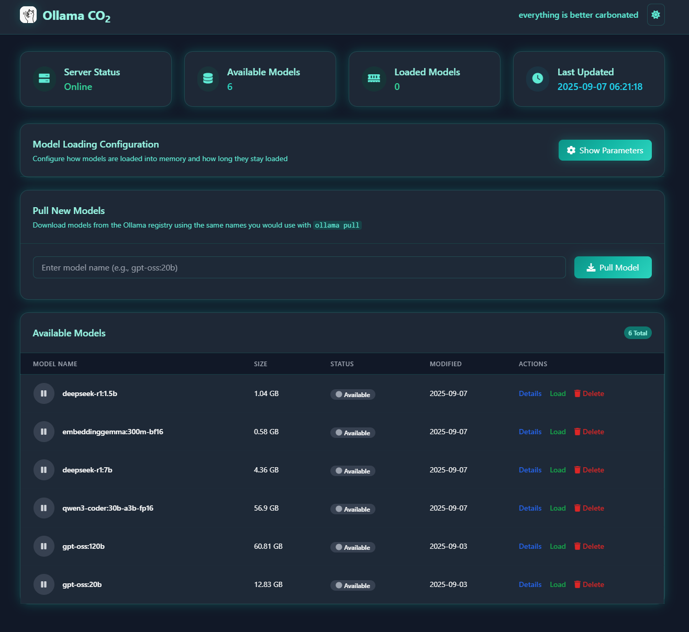
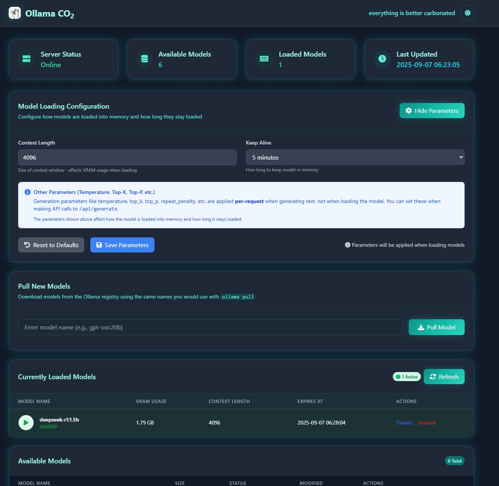
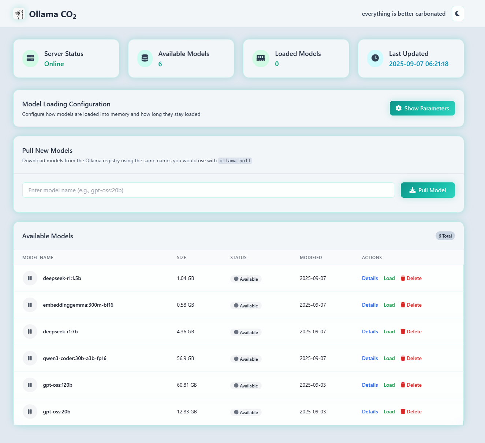
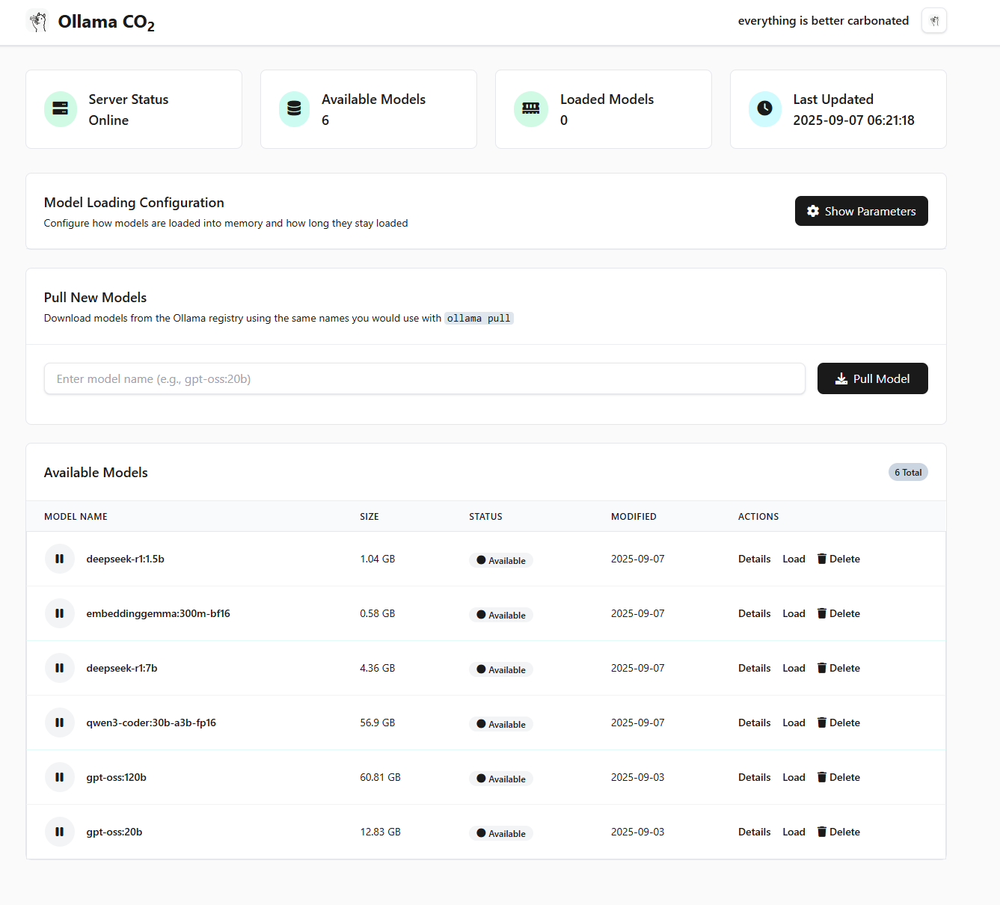

<div align="center">
  
</div>

# Ollama CO₂ from carbonatedWater.org

It's a FastAPI web interface for monitoring and managing an Ollama server, from the DEFINITIVE, OFFICIAL, WORLDWIDE provider of Carbonated Water rankings, carbonatedWater.org.

## Features

- **Real-time Model Monitoring**: Track available and loaded models with VRAM usage
- **Concurrent Downloads**: Download models, concurrently.
- **Model Management**: Load/unload models, view detailed information
- **Clean Interface**: Kind of.

## Themes

A few to choose from.

<div align="center">
  <a href="static/ollama-co2-dark.png" target="_blank">
    
  </a>
  <a href="static/ollama-co2-darkexample.png" target="_blank">
    
  </a>
  <a href="static/ollama-co2-light.png" target="_blank">
    
  </a>
  <a href="static/ollama-co2-white.png" target="_blank">
    
  </a>
</div>

## Docker Deployment

```bash
# Clone the project into your current directory
git clone https://github.com/carbonatedWaterOrg/ollama-co2 .

# Create required .env file
echo "OLLAMA_BASE_URL=http://your-ollama-server:11434" > .env

# Deploy with Docker
docker-compose up -d
```

Visit `http://localhost:8000` to access the dashboard.

## Manual Installation

```bash
# Install dependencies
pip install fastapi uvicorn[standard] jinja2 python-multipart aiofiles aiohttp python-dotenv

# Create required .env file
echo "OLLAMA_BASE_URL=http://your-ollama-server:11434" > .env

# Start server
uvicorn main:app --reload --host 0.0.0.0 --port 8000
```

## Requirements

- Docker & Docker Compose (recommended) OR Python 3.13+
- Running Ollama server
- `.env` file with `OLLAMA_BASE_URL`

## Recommendations

- Run it in the same Docker network as your Ollama container.
- Put it behind a reverse proxy. We like Caddy.

## Built With

[FastAPI](https://fastapi.tiangolo.com/) • [Uvicorn](https://www.uvicorn.org/) • [Tailwind CSS](https://tailwindcss.com/) • [Font Awesome](https://fontawesome.com/) • [Docker](https://www.docker.com/)

## License

Open source project using MIT licensed dependencies. Tailwind CSS redistributed as compiled CSS in `static/tailwind.css`.
